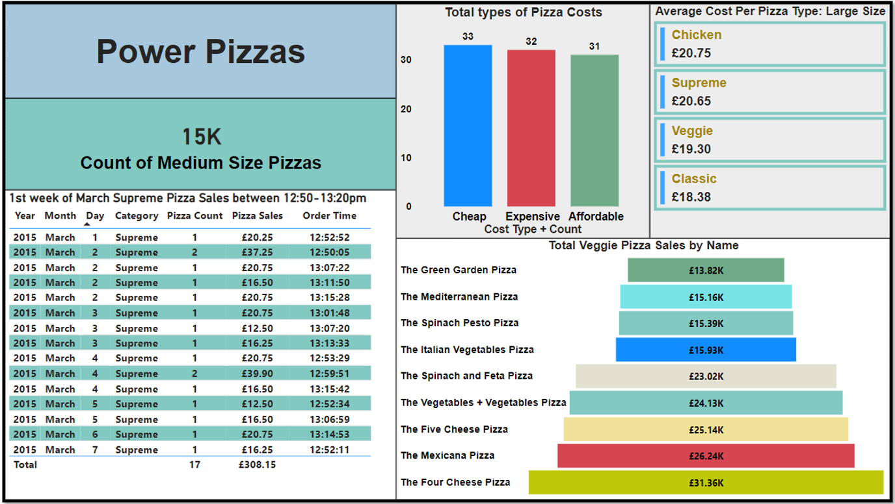
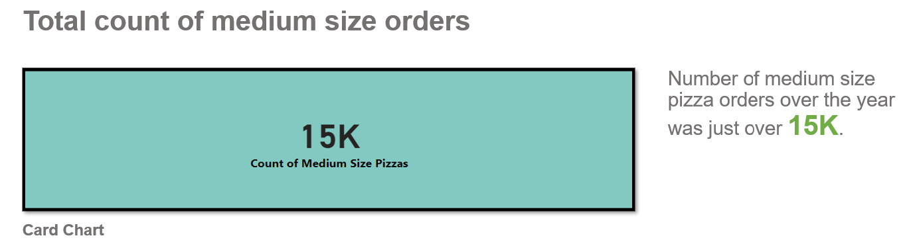
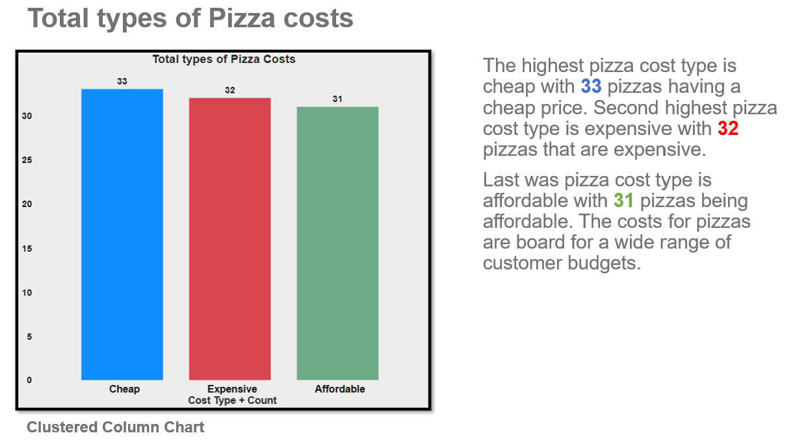
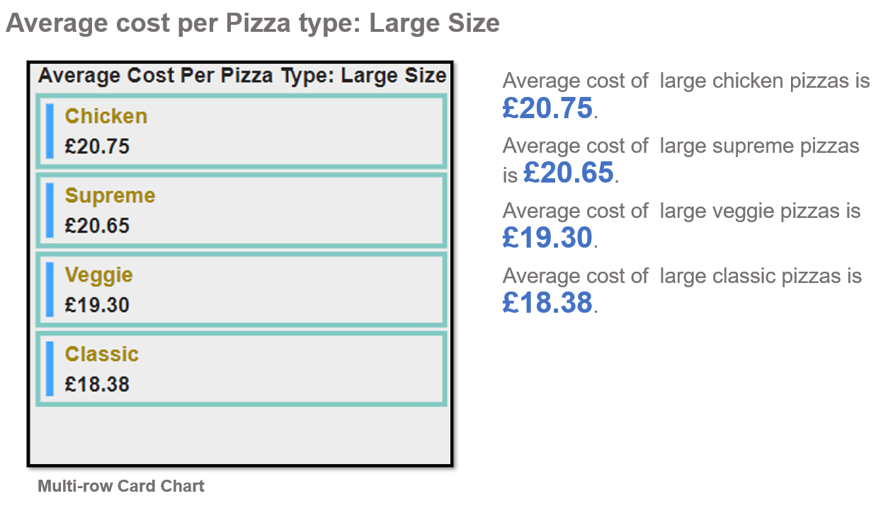
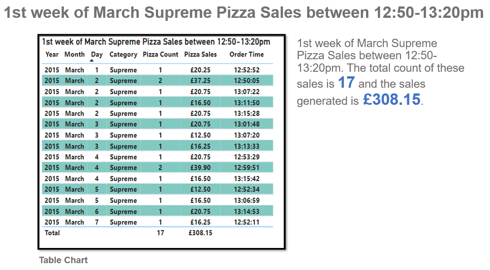
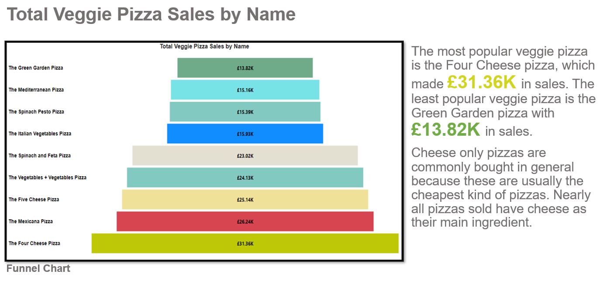

# PowerPizzas
## Power Pizzas Dashboard

 

### Dashboard displaying pizza orders from 2015 data. Using SQL queries/tables/views, next turning them into visualizations then into a dashboard using Power BI.

In this report I will analyse the data of pizza orders.

### I will mention: 
<li>Total count of medium size orders: (Card Chart)
<li>Total types of Pizza costs: (Clustered Column Chart)
<li>Average cost per Pizza type: Large size: (Multi-row Card Chart)
<li>1st week of March Supreme Pizza Sales between 12:50-13:20pm: (Table Chart)
<li>Total Veggie Pizza Sales by Name: (Funnel Chart)

### Software used:
Microsoft SQL Server: For Data Exploration and to transfer the queries/tables/views to Power BI.
Microsoft Power BI: Created five visualizations to produce a dashboard to show the different findings.

 
  
 
 
 
 
 

 
